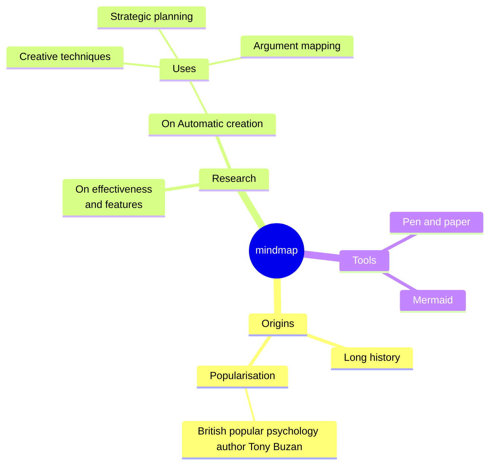

# Prêt ?

---

|     Code     |      Icône |
|:------------:|-----------:|
| `:computer:` | :computer: |
| `:keyboard:` | :keyboard: |
|  `:wrench:`  |   :wrench: |

---

  <table>
    <thead>
      <tr>
        <th>Code</th>
        <th>Icône</th>
      </tr>
    </thead>
    <tbody>
      <tr>
        <td><code>:computer:</code></td>
        <td class="big-droite">💻</td>
      </tr>
      <tr>
        <td><code>:keyboard:</code></td>
        <td style="font-size:18px; text-align:left">⌨️</td>
      </tr>
      <tr>
        <td><code>:wrench:</code></td>
        <td class="big-droite">🔧</td>
      </tr>
    </tbody>
  </table>

