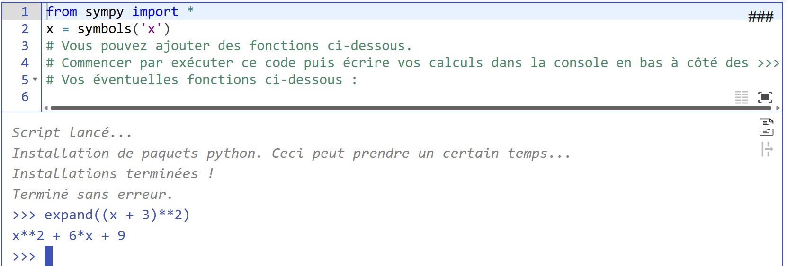
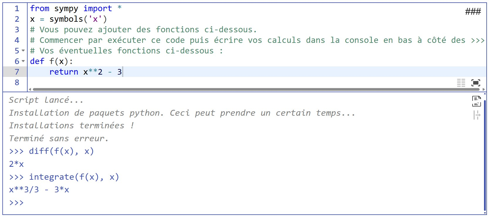

## Pour des calculs

??? note "Comment utiliser sympy pour des calculs formels"

    Commencer par exécuter le code. Vous pourrez écrire vos calculs dans la partie console (en dessous de l'éditeur, à côté de `>>>`).

    Par exemple : 

    { width=60% }

    Vous pouvez aussi définir des fonctions dans la partie éditeurs, exécuter le code, et ensuite utiliser la console : 

    { width=60% }

{{ IDE('scripts/sympy_vide', ID=1, MIN_SIZE=6) }}

## Pour des graphiques

{{ IDE('scripts/graphe_ex1') }}
{{ figure() }}

## Plusieurs graphiques dans des fenêtres séparées dans la même page

{{ IDE('scripts/fct_carre') }}
{{ figure('cible_1') }}

{{ IDE('scripts/fct_sqrt') }}
{{ figure('cible_2') }}

_Crédits pour l'intégration de la bibliothèque sympy : Frédéric Zinelli_

