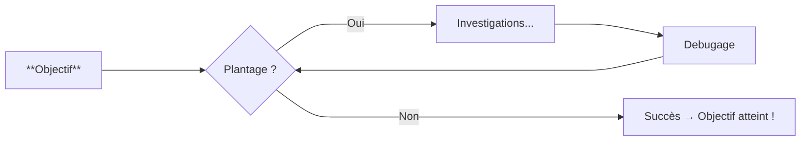

<div align="center">
  
  <h1>Bienvenue dans l'univers PyMoX 😊 !</h1>
</div>

## Qu'est-ce que PyMoX ?

PyMoX est un projet open-source qui vise à créer une communauté autour de la programmation avec Python, et tout ce qui gravite autour...

**Site en contruction...** En attendant, prépare-toi, et fait mumuse 😉&nbsp;...

Gabin disait dans l'un de ses films: "Je pense que le jour où l'on mettra les cons sur orbite, t'auras pas fini de tourner..."

## Prérequis: Comprendre la programmation



Donc, ouiais... Selon Gabin (Et pas que), faut sortir de la boucle !

## Pour cela, joues avec les bases du langage Python

### Dans un terminal

Pour démarrer, un simple **terminal** (*Idle*) cependant opérationnel, avec ici un script pré-enregistré, qui affiche 7 nombres aléatoires entre 1 et 10
(Clique dedans + ENTRÉE, puis flèche du haut + ENTRÉE pour ré-itérer l'expérience... Mais tu peux aussi y modifier le code... 😊 !) :

{{ terminal(FILL=
"import random as rd
print(*[rd.randint(1,10) for _ in range(7)])"
) }}

### Dans un IDE

=== "Un ch'ti bac à sable de Python pour patienter ?"

{{ IDE('sympy/scripts/construction_sandbox_graph_00.py') }}

... Et quand ça finira par te lasser, car, ça finira par te lasser..., alors, pour avoir un regain de motivation et en plus, l'aisance du ***Hot-reload*** [^1] dans la ***CLI*** [^2], il te faudra "**p't'être bien**" [^4] ["***forker*" ce projet**](https://github.com/PyMoX-fr/PyMoX-fr.github.io/fork) [^3], pour un jour, peut-être, devenir capable de faire un '***PR***' [^5]...

### :boom: Pour aller + loin

??? "... Et pour les vrais codeurs..."

    Pour voir vos modifications en ***Hot-reload*** [^1] dans la ***CLI*** [^2], et si vous avez donc déjà ["***fork"* ce projet**](https://github.com/PyMoX-fr/PyMoX-fr.github.io/fork)[^3], alors, ouvrez une CLI, rendez-vous dans le dossier du projet et lancez la commande suivante:

    ``` flet run .\docs\sympy\scripts\construction_sandbox_graph_77.py
    ```
    
    Après, si ce que vous avez fait vous semble sympa, alors, committez votre travail et envoyez-le sur le dépôt officiel (Faites alors un ***P.R.*** [^5]  😊).
    
    {{ IDE('sympy/scripts/construction_sandbox_graph_77.py') }}
    
    ... Et quand de cela lassé tu es aussi, utilises le lien ci-dessous pour rester *On line*<sup>*</sup> (Et du coup, plus jamais ainsi dans la boucle tu seras 😉 !)
    
    \* En ligne
    
[^1]: Hot-reload = Rafraîchissement automatique (On dit aussi "Live reload")
[^2]: CLI = La console (Console Line Interface)
[^3]: Fork = Copie d'un dépôt
[^4]: Référence <a href="https://fr.wikipedia.org/wiki/K-PAX_:_L'Homme_qui_vient_de_loin" title="Un super film à voir absolument... Si ce n'est pas d'jà fait, et si oui...: À revoir !" target='_blank'>K-PAX</a>... (Une des répliques de Jeff Bridges...)
[^5]: <b>P</b>ull-<b>R</b>equest = Demande de fusion de votre développement dans le dépôt officiel

## → <span style="text-align:center"> Contacte-nous <a href="https://discord.com/channels/1395436334507626566/1395436335103213571" target="_blank" rel="noopener"><span style="font-size: 1.1em;">via notre Discord </span></a></span>
