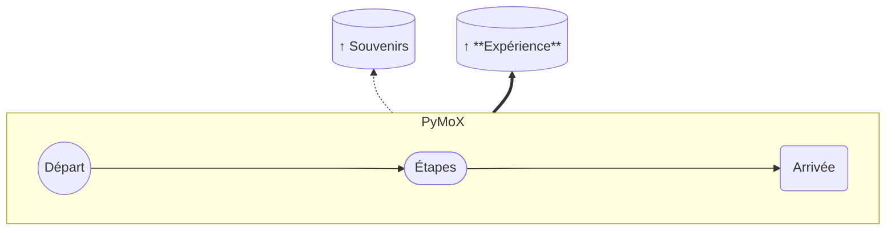

# Prêt ?

```mermaid
  flowchart BT
    subgraph PX[PyMoX]
      direction LR
      A((Départ))------>B([Étapes])------>C(Arrivée)
    end
    PX-.->E[(↑ Souvenirs)]
    PX==>D[(↑ **Expérience**)]
```
