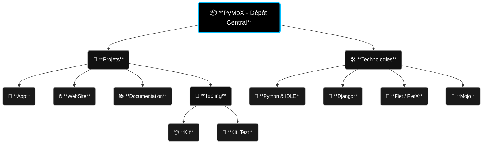

```mermaid
flowchart TD

  %% --- Styles ---
  classDef core fill:#000,stroke:#00bfff,stroke-width:3px,color:#fff,font-size:18px
  classDef section fill:#111,stroke:#888,stroke-width:2px,color:#fff,font-size:15px
  classDef repo fill:#1a1a1a,stroke:#ccc,stroke-width:1.5px,color:#fff,font-size:14px

  %% --- Core ---
  Core("📦 **PyMoX - Dépôt Central**")

  %% --- Sections principales ---
  Projects("📁 **Projets**")
  Tech("🛠️ **Technologies**")

  %% --- Arborescence ---
  Core --> Projects
  Core --> Tech

  %% --- Projets ---

  Projects --> App("📱 **App**")
  Projects --> Web("🌐 **WebSite**")
  Projects --> Doc("📚 **Documentation**")
  Projects --> Tooling
  Tooling("🧰 **Tooling**")

  %% --- Technologies ---
  Tech --> Py("🐍 **Python & IDLE**")
  Tech --> Dj("🚀 **Django**")
  Tech --> Fx("🎨 **Flet / FletX**")
  Tech --> Mj("🧬 **Mojo**")

  %% --- Tooling ---
  Tooling --> Kit("📦 **Kit**")
  Tooling --> KitTest("🧪 **Kit_Test**")

  %% --- Classes ---
  class Core core
  class Projects,Tech,Tooling section
  class App,Web,Doc,Py,Dj,Fx,Mj,Kit,KitTest repo

  %% --- Liens ---
  click Core "https://github.com/PyMoX-fr/PyMoX" _blank
  click App "https://github.com/PyMoX-fr/App" _blank
  click Web "https://github.com/PyMoX-fr/WebSite" _blank
  click Doc "https://github.com/PyMoX-fr/Doc" _blank
  click Py "https://github.com/PyMoX-fr/Python" _blank
  click Dj "https://github.com/PyMoX-fr/Django" _blank
  click Fx "https://github.com/PyMoX-fr/FletX" _blank
  click Mj "https://github.com/PyMoX-fr/Mojo" _blank
  click Kit "https://github.com/PyMoX-fr/Kit" _blank
  click KitTest "https://github.com/PyMoX-fr/Kit_Test" _blank
```
